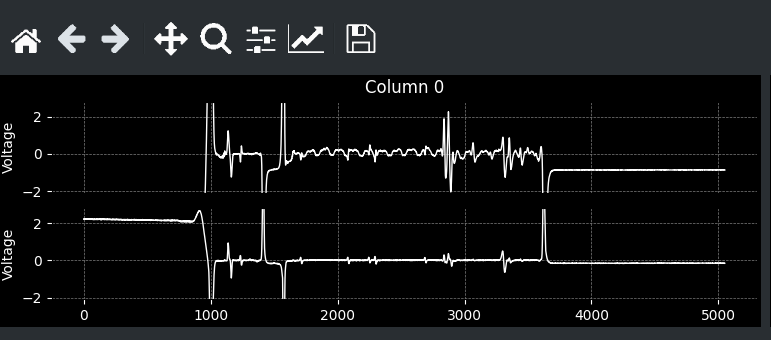
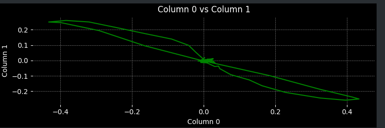
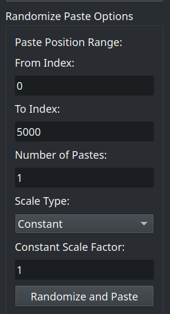

# Data Visualization Tool

Цей інструмент для візуалізації та обробки даних вихрострумового контролю теплообмінних труб парогенераторів ВВЕР, розроблений із використанням **PyQt5** та **matplotlib**, дозволяє:

- Завантажувати дані (формати CSV, DAT, TXT або файли з просторовим розділенням).
- Візуалізувати дані у вигляді пар графіків:
  - Графіки «напруга проти індексу».
  - Графіки «напруга на першому сенсорі проти другого».
- Інтерактивно виділяти діапазони даних за допомогою SpanSelector або через точне задання індексів.
- Копіювати та вставляти дані (з можливістю масштабування та випадкового розміщення вставок).
- Обчислювати амплітуду та фазу даних за допомогою зовнішньої функції `get_amp_phase`.

## Особливості

- **Завантаження даних:**  
  Програма підтримує CSV-файли з заголовками, а також файли з просторовим розділенням (без заголовків). Дані автоматично реверсуються (якщо необхідно) та індексуються.

- **Візуалізація:**  
  Для кожної пари колонок формується два типи графіків:
  - Графіки, де дані однієї колонки відображаються проти індексу.
  
  - Графік залежності однієї колонки від іншої.
  
- **Інтерактивність:**  
  - За допомогою SpanSelector можна виділити певний діапазон даних, що дозволяє обчислювати амплітуду та фазу для вибраних значень. Крім того, є можливість точного задання індексів для виділення.
  - За допомогою кнопок matplotlib можна змінювати масштаб та відображення графіків

- **Копіювання та вставка:**  
  Програма підтримує:
  - Копіювання виділеного діапазону даних (Ctrl+C).
  - Вставку даних із зазначенням позиції та масштабування (Ctrl+V).
  - Випадкове розміщення вставок із можливістю задати постійний або випадковий коефіцієнт масштабу (Ctrl+Shift+V).

- **Параметр запуску --num_pairs:**  
  За допомогою командного рядка можна задати кількість пар колонок для візуалізації. Наприклад, для відображення лише 3 пар використовуйте:
  ```bash
  python main.py --num_pairs 3
  ```

## Вимоги

- **Python 3.x**
- **PyQt5**
- **matplotlib**
- **pandas**
- **numpy**
- Модуль `phase.py` (повинен містити функцію `get_amp_phase`)

## Інсталяція

1. **Клонування репозиторію:**
    ```bash
    git clone https://github.com/postcanonical/analysis.git
    cd analysis
    ```

2. **Встановлення залежностей:**
    Спочатку створіть [venv](https://docs.python.org/3/library/venv.html)
    ```
    python -m venv .venv
    source .venv/bin/activate
    ```
    Використовуйте файл `requirements.txt`:
    ```bash
    pip install -r requirements.txt
    ```

3. **Переконайтеся, що модуль `phase.py` знаходиться у вашому проєкті.**

## Запуск програми

Запустіть програму, виконавши наступну команду:
```bash
python main.py
```

### Використання параметра --num_pairs (-n)

Щоб встановити заздалегідь визначену кількість пар колонок для відображення (наприклад, 3), запустіть програму так:
```bash
python main.py --num_pairs 3
```
Це дозволить обмежити кількість пар графіків, навіть якщо даних більше.

## Інтерфейс користувача

Після запуску відкривається головне вікно, що містить:

- **Графічну область:**  
  Ліва частина вікна, де відображаються графіки:
  - Графіки «колонка проти індексу».
  - Графіки «колонка проти колонки».
- **Бокове меню:**  
  Права частина вікна з кнопками для доступу до функцій:
  - **Data Interference (Інтерференція даних):**  
    Опції для копіювання, вставки та випадкового розміщення вставок.
    - **Randomize Paste Positions** - основна функція програми - випадкове розміщення вставок. Можна вставляти дані випадковим чином в діапазоні від **From Index** до **To Index**, обрати кількість вставок та визначити коефіцєнт на який помножаться дані, або обрати випадковий в діапазоні.

        
        
  - **Precise Data Selection (Точний вибір даних):**  
    Можливість вибрати діапазон даних за індексами.
  - **Save Data to File (Зберегти дані у файл):**  
    Збереження обраного діапазону або всіх даних у CSV-файл.
  - **Load Data (Завантажити дані):**  
    Завантаження нового файлу з даними.

## Основні операції

### Виділення даних

- **Інтерактивне виділення:**  
  За допомогою SpanSelector (використовуйте мишу) виділіть потрібний діапазон.  
  Виділення також можна здійснювати через точне задання індексів у меню "Precise Data Selection".

### Копіювання та вставка

- **Копіювання:**  
  Після виділення даних натисніть `Ctrl+C` або скористайтесь відповідною кнопкою в меню.
  
- **Вставка:**  
  Для вставки даних натисніть `Ctrl+V`.  
  Якщо потрібно здійснити випадкову вставку, скористайтесь комбінацією `Ctrl+Shift+V` або виберіть опцію **"Randomize Paste Positions"** у меню.

### Обчислення амплітуди та фази

Після виділення даних програма автоматично обчислює амплітуду та фазу для кожної пари колонок з використанням функції `get_amp_phase`. Результати відображаються у статус-барі в нижній частині бокового меню. Також корисно дивитись за інформацією в терміналі, яка теж оновлюється.

## Налагодження та додаткова інформація

- **Консольні повідомлення:**  
  Програма виводить інформацію про завантаження даних, копіювання, вставку та обчислення параметрів у консоль для налагодження.
  
- **Обробка помилок:**  
  У випадку виникнення помилок (наприклад, невірний формат файлу або проблеми з обчисленням) з’являться відповідні повідомлення.

- **Відображення ймовірності дефекту:**  
  Якщо датасет має колонки з назвою `defect_proba_N`, то прогамма замалює червоним кольором ті значення, які ближче до 1 на графіках `N`, де `N` - це номер пари колонок.

## Ліцензія

Цей проєкт розповсюджується за ліцензією MIT.

## Авторство

- **Контактна інформація:** Telegram: [postcanonical](https://t.me/postcanonical)
